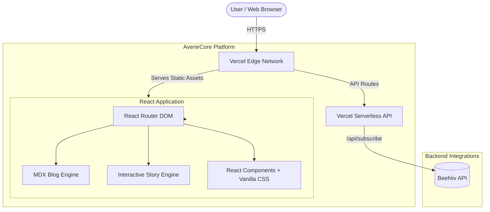
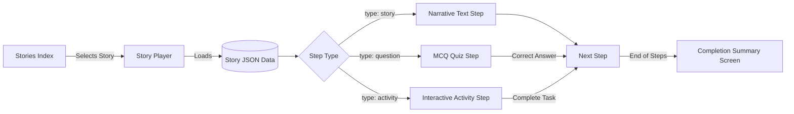

# AvenirCore Architecture & Component Overview

This document illustrates the current system architecture, technical stack, and routing topology for the AvenirCore website. You can use these mermaid diagrams inside GitHub, Notion, or Miro to visualize the system.

## High-Level Architecture

The platform uses a modern decoupled architecture, combining a Vite/React Single Page Application (SPA) for the frontend with Vercel Serverless Functions for backend integrations.



## Routing & Page Topology

```mermaid
graph TD
    App[App.jsx Main Router] --> Header[Global Header]
    App --> Footer[Global Footer]
    App --> Routes{Route Switch}
    
    Routes --> Home[/ Home ]
    Routes --> BlogPages[/blog]
    Routes --> StoriesPages[/stories]
    Routes --> StaticPages[Static Pages]

    Home --> Hero
    Home --> Stats
    Home --> Values
    Home --> Roadmap
    Home --> EmailCapture

    BlogPages --> BlogIndex[Blog Index]
    BlogPages --> Pillar[Guides / Pillar Pages]
    BlogPages --> Posts[MDX Blog Posts]

    StoriesPages --> StoryIndex[Story Library Index]
    StoriesPages --> StoryPlayer[Interactive Story Player]
    
    StaticPages --> About[About]
    StaticPages --> Privacy[Privacy Policy]
    StaticPages --> Terms[Terms of Service]
```

## Interactive Stories Flow



## Editing Screens using Figma

While these graphs represent application logic, if you need to visualize and edit the actual frontend UI screens matching production:
1. Use the **"Figma to HTML, CSS, React & more!"** plugin in Figma.
2. Point it directly to `https://avenircore.com` or specific routes like `/stories`.
3. The plugin will accurately scrape the DOM into editable Figma vector files.
