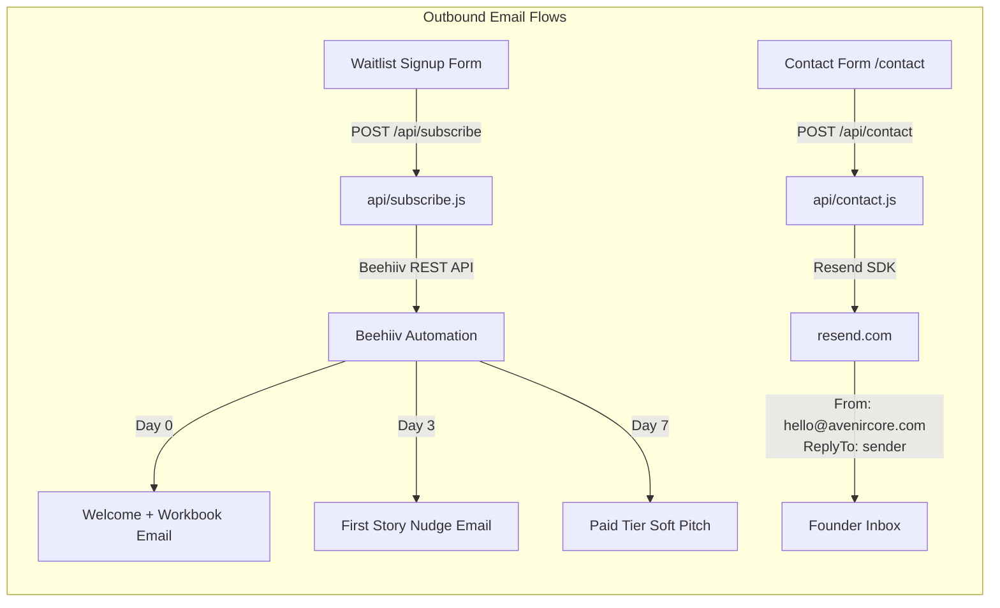
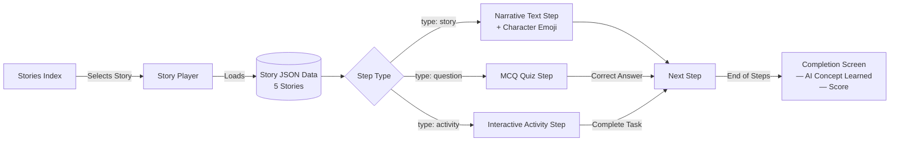

# AvenirCore Architecture & Component Overview

This document illustrates the current system architecture, technical stack, and routing topology for the AvenirCore website. You can use these Mermaid diagrams inside GitHub, Notion, or Miro to visualize the system.

## High-Level Architecture

The platform uses a modern decoupled architecture, combining a Vite/React Single Page Application (SPA) for the frontend with Vercel Serverless Functions for backend integrations.

```mermaid
graph TD
    User([User / Web Browser]) -->|HTTPS| Vercel[Vercel Edge Network]
    
    subgraph AvenirCore Platform
        Vercel -->|Serves Static Assets| Frontend[Vite + React SPA]
        Vercel -->|API Routes| Serverless[Vercel Serverless API]
    end

    subgraph Frontend [React Application]
        Router[React Router DOM]
        MDX[MDX Blog Engine]
        StoryEngine[Interactive Story Engine]
        UI[React Components + Vanilla CSS]
    end

    subgraph Backend Integrations
        Serverless -->|/api/subscribe| Beehiiv[(Beehiiv API\nEmail Waitlist)]
        Serverless -->|/api/contact| Resend[(Resend API\nTransactional Email)]
        Resend -->|hello@avenircore.com| Inbox[Founder Inbox]
    end

    Frontend --> Router
    Router --> MDX
    Router --> StoryEngine
    Router --> UI
```

## Email Infrastructure

The platform uses two separate email services for different purposes:



### Email Service Configuration

| Service | Purpose | Domain Status |
|---|---|---|
| **Beehiiv** | Newsletter & waitlist automation | Configured via Beehiiv dashboard |
| **Resend** | Transactional contact form emails | ✅ `avenircore.com` domain verified (DKIM + SPF) |

**Environment variable required:** `RESEND_API_KEY` → set in Vercel project environment variables.

**Email sequence copy** ready to paste into Beehiiv automations:
- [`docs/email-sequences/01-welcome.md`](email-sequences/01-welcome.md) — Day 0: Welcome + workbook download
- [`docs/email-sequences/02-first-story.md`](email-sequences/02-first-story.md) — Day 3: First story nudge
- [`docs/email-sequences/03-paid-tier-intro.md`](email-sequences/03-paid-tier-intro.md) — Day 7: Paid tier soft pitch

---

## Routing & Page Topology

```mermaid
graph TD
    App[App.jsx Main Router] --> Header[Global Header]
    App --> Footer[Global Footer]
    App --> Routes{Route Switch}
    
    Routes --> Home[/ Home]
    Routes --> BlogPages[/blog]
    Routes --> StoriesPages[/stories]
    Routes --> Contact[/contact]
    Routes --> StaticPages[Static Pages]

    Home --> Hero
    Home --> Stats
    Home --> Values
    Home --> StoriesTeaser[Stories Teaser Section]
    Home --> Roadmap
    Home --> EmailCapture

    BlogPages --> BlogIndex[Blog Index]
    BlogPages --> Pillar[Guides / Pillar Pages]
    BlogPages --> Posts[MDX Blog Posts]

    StoriesPages --> StoryIndex[Story Library Index]
    StoriesPages --> StoryPlayer[Interactive Story Player]
    
    Contact --> AudienceSelector[Parent / Teacher / Press Selector]
    Contact --> ContactForm[Contact Form → /api/contact]
    
    StaticPages --> About[About]
    StaticPages --> Privacy[Privacy Policy]
    StaticPages --> Terms[Terms of Service]
```

---

## Interactive Stories Flow

The story engine is fully data-driven via JSON. Adding a new story requires only a new JSON file in `src/data/stories/` — no component changes needed.



### Story JSON Schema

```json
{
  "id": "story-id",
  "title": "Story Title",
  "description": "One-line description",
  "ageRange": "6–8",
  "difficulty": "Beginner",
  "aiConcept": "Pattern Recognition",
  "character": {
    "name": "Robi",
    "emoji": "🤖",
    "color": "#6366f1"
  },
  "steps": [
    { "type": "story", "content": "..." },
    { "type": "question", "question": "...", "options": ["A","B","C","D"], "correct": 0 },
    { "type": "activity", "instruction": "...", "options": ["X","Y","Z"], "correct": 1 }
  ]
}
```

**Difficulty values:** `"Beginner"` | `"Intermediate"`  
**Age range values:** `"6–8"` | `"8–10"`

---

## Current Story Library

| ID | Title | Character | Age | Concept |
|---|---|---|---|---|
| `curious-robot` | The Curious Robot | 🤖 Robi | 6–8 | Pattern Recognition |
| `smart-assistant` | The Smart Assistant | 🎙️ Aria | 6–8 | AI Decision Making |
| `data-detective` | The Data Detective | 🕵️ Dan | 6–8 | Data Quality |
| `kind-ai` | Being Kind to AI | 🌸 Mira | 6–8 | AI Ethics |
| `ai-mistake` | When AI Gets It Wrong | 🔍 Finn | 8–10 | AI Limitations |

---

## SEO & Schema Markup

Each story page (`/stories/:id`) automatically renders:
- `<Helmet>` with per-story `<title>` and `<meta description>` via `react-helmet-async`
- `<script type="application/ld+json">` with a `LearningResource` schema block

The `/contact` page renders a `ContactPage` JSON-LD schema block.

---

## Editing Screens using Figma

While these graphs represent application logic, if you need to visualize and edit the actual frontend UI screens matching production:
1. Use the **"Figma to HTML, CSS, React & more!"** plugin in Figma.
2. Point it directly to `https://avenircore.com` or specific routes like `/stories`.
3. The plugin will accurately scrape the DOM into editable Figma vector files.
